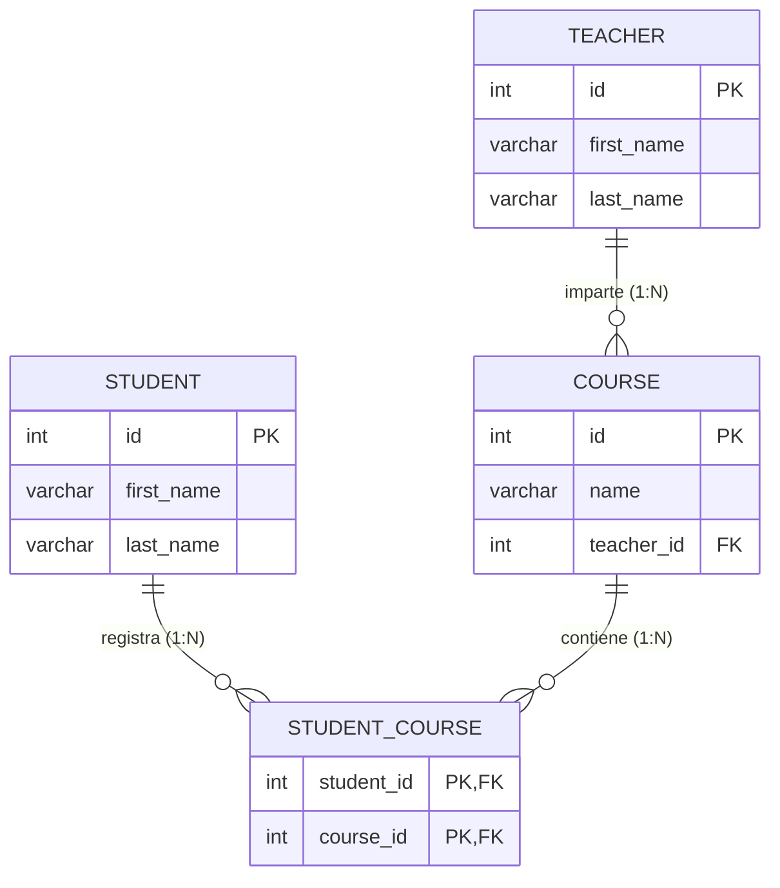
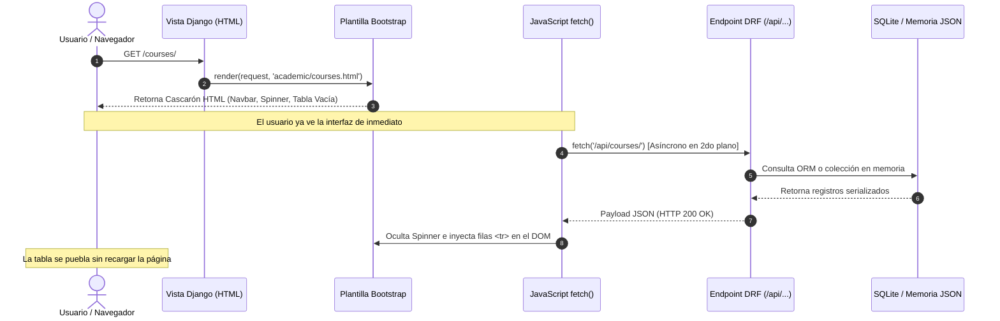

# Sistema de Gestión Académica - Evaluación N°1 (Backend con Django & DRF)


**Asignatura:** Desarrollo Backend  
**Docente:** Marcelo Alvarado  
**Ponderación:** 15% de la nota final  
**Modalidad:** Individual con Escala de Apreciación (Tiempo: 90 minutos)  

[](guia_estudio_defensa.html)
[](guia_estudio_defensa.html)

> [!IMPORTANT]
> ### 🎮 Plataforma Interactiva de Defensa Oral & Simulador (Criterio 10)
> Para entrenar o evaluar en tiempo real las competencias técnicas del proyecto:
> - **🖥️ En local:** Haz doble clic en el archivo [`guia_estudio_defensa.html`](./guia_estudio_defensa.html) para abrir el simulador en tu navegador.
> - **🌐 Vista en vivo online:** Puedes abrirlo directamente en la web con [HTMLPreview](https://htmlpreview.github.io/?https://github.com/TU_USUARIO/Sistema-de-Gesti-n-Acad-mica--academic-system-django-drf/blob/main/guia_estudio_defensa.html) o GitHub Pages sin necesidad de instalar nada.
> - **Contenido interactivo:** Infografía visual de arquitectura, temporizador de 60s, banco de 22 preguntas con respuestas modelo y 10 preguntas de carpetas con metáforas de la vida real.

---

## Tabla de Contenidos
1. [Descripción y Contexto del Caso](#1-descripción-y-contexto-del-caso)
2. [Habilidades (Skills) Aplicadas y Repositorio](#2-habilidades-skills-aplicadas-y-repositorio)
3. [Modelo Entidad-Relación (ER)](#3-modelo-entidad-relación-er)
4. [Arquitectura del Proyecto y Enmascaramiento](#4-arquitectura-del-proyecto-y-enmascaramiento)
5. [Estructura de Directorios](#5-estructura-de-directorios)
6. [Instalación y Puesta en Marcha](#6-instalación-y-puesta-en-marcha)
7. [Catálogo de Endpoints y Vistas](#7-catálogo-de-endpoints-y-vistas)
8. [Matriz de Cumplimiento de la Rúbrica (32/32 pts)](#8-matriz-de-cumplimiento-de-la-rúbrica-3232-pts)
9. [Guía de Control de Versiones con Git y GitHub](#9-guía-de-control-de-versiones-con-git-y-github)
10. [Balotario de Preparación para la Interrogación Oral](#10-balotario-de-preparación-para-la-interrogación-oral)

---

## 1. Descripción y Contexto del Caso

El **Sistema de Gestión Académica** es una solución desarrollada para satisfacer las necesidades operativas de una institución educativa. La plataforma integra un backend robusto en **Django** y **Django REST Framework (DRF)** acoplado a un frontend desacoplado mediante el patrón de **enmascaramiento de endpoints**:

- **Navegación Visual HTML:** El usuario final navega por vistas HTML limpias y estilizadas con **Bootstrap 5.3 CDN** (`courses.html`, `students.html`).
- **Consumo Asíncrono en Segundo Plano:** El navegador web utiliza JavaScript Vanilla con la función asíncrona `fetch()` para consultar los endpoints JSON en `/api/...` e inyectar dinámicamente los datos en el DOM sin recargas de página.
- **Soporte Dual de Datos:** La aplicación está diseñada para funcionar tanto con la base de datos relacional SQLite mediante el ORM de Django, como de manera 100% independiente en memoria cargando datos desde el archivo `academic_data.json` (cumpliendo a cabalidad con el Indicador 2 de la pauta).
- **Ruta Raíz Optimizada:** Se implementó una redirección automática en `/` hacia `/courses/`, eliminando el error HTTP 404 exigido en el requerimiento técnico 4.

---

## 2. Habilidades (Skills) Aplicadas y Repositorio

Para el desarrollo de este proyecto se descargó e implementó el compendio completo de habilidades desde:
- **Repositorio de Origen:** [https://github.com/garri333/Skills.git](https://github.com/garri333/Skills.git)
- **Documento de detalle:** [`prompts & skills.md`](./prompts%20&%20skills.md)

### Resumen de Skills Clave Utilizadas:
1. `03-backend-api/api-design`: Convenciones RESTful, códigos de respuesta HTTP, serializadores anidados y estructuración de respuestas JSON.
2. `02-frontend-design/frontend-design`, `uiux-pro`, `web-design-guidelines`: Maquetación responsiva con Bootstrap 5.3, estados visuales (spinners de carga, alertas de error, contadores badge, buscador reactivo).
3. `13-anthropic/theme-factory`: Armonización cromática para un panel académico profesional.
4. `04-ai-agents/coding-agent` & `prompt-engineering`: Diseño de prompts para generación de estructuras de datos y plantillas.
5. `05-devops-git/git-conventional-commits`: Estructura semántica de commits y configuración de `.gitignore`.
6. `19-testing-quality/code-quality-audit` & `systematic-debugging`: Código "full comentado" línea por línea y suite de 18 pruebas automatizadas.
7. `21-productivity/codebase-health-reporter`: Documentación exhaustiva y trazabilidad de requerimientos.

---

## 3. Modelo Entidad-Relación (ER)

El esquema implementado se fundamenta en las 4 entidades descritas en la pauta de evaluación:



### Detalle de Entidades y Tipos de Datos (en `academic/models.py`):
1. **`Teacher` (Docentes):**
   - `id`: `AutoField(primary_key=True)` (Clave primaria autoincremental).
   - `first_name`: `CharField(max_length=100)`.
   - `last_name`: `CharField(max_length=100)`.
2. **`Course` (Asignaturas):**
   - `id`: `AutoField(primary_key=True)`.
   - `name`: `CharField(max_length=150)`.
   - `teacher_id`: `ForeignKey(Teacher, on_delete=models.CASCADE, db_column='teacher_id')` (Relación N:1).
3. **`Student` (Estudiantes):**
   - `id`: `AutoField(primary_key=True)`.
   - `first_name`: `CharField(max_length=100)`.
   - `last_name`: `CharField(max_length=100)`.
4. **`StudentCourse` (Inscripciones / Matrícula):**
   - `student_id`: `ForeignKey(Student, db_column='student_id')`.
   - `course_id`: `ForeignKey(Course, db_column='course_id')`.
   - `unique_together`: `('student', 'course')` (Clave compuesta para evitar inscripciones duplicadas).

---

## 4. Arquitectura del Proyecto y Enmascaramiento

El "enmascaramiento" de endpoints separa limpiamente la capa de presentación de la capa de datos:



---

## 5. Estructura de Directorios

```text
Sistema-de-Gesti-n-Acad-mica--academic-system-django-drf-main/
│
├── academic/                          # Aplicación de dominio académico (Django App)
│   ├── data/
│   │   └── academic_data.json         # Dataset simulado estructurado en JSON (modo en memoria)
│   ├── management/
│   │   └── commands/
│   │       ├── __init__.py
│   │       └── seed_data.py           # Comando CLI personalizado: python manage.py seed_data
│   ├── migrations/                    # Historial de migraciones del ORM
│   │   ├── __init__.py
│   │   └── 0001_initial.py            # Migración inicial de tablas del esquema ER
│   ├── templates/academic/            # Plantillas HTML a nivel de aplicación
│   │   ├── base.html                  # Layout base con navbar y Bootstrap 5.3 CDN
│   │   ├── courses.html               # Listado de asignaturas con fetch asíncrono
│   │   └── students.html              # Nómina de estudiantes con buscador en tiempo real
│   ├── __init__.py
│   ├── admin.py                       # Configuración y personalización en Django Admin
│   ├── apps.py                        # Definición y metadatos de la aplicación
│   ├── data_manager.py                # Módulo de gestión en memoria y carga desde JSON
│   ├── models.py                      # Modelos del esquema ER (Teacher, Course, Student, StudentCourse)
│   ├── serializers.py                 # Serializadores DRF (ModelSerializer con campos calculados)
│   ├── tests.py                       # Suite de 18 pruebas automatizadas (unitarias e integración)
│   ├── urls.py                        # Mapeo de rutas web (/courses/, /students/) y API (/api/...)
│   └── views.py                       # Vistas HTML (render) y Endpoints API REST (APIView)
│
├── academic_project/                  # Paquete de configuración central del proyecto Django
│   ├── __init__.py
│   ├── asgi.py                        # Configuración ASGI para servidores compatibles
│   ├── settings.py                    # Configuración global (DRF, apps, BD, templates)
│   ├── urls.py                        # Enrutador principal y redirección de ruta raíz '/'
│   └── wsgi.py                        # Configuración WSGI para despliegue estándar
│
├── templates/                         # Directorio global de plantillas HTML
│   └── academic/
│       ├── base.html                  # Layout base compartido
│       ├── courses.html               # Vista de cursos
│       └── students.html              # Vista de estudiantes
│
├── .gitignore                         # Reglas de exclusión de archivos temporales para Git
├── db.sqlite3                         # Base de datos relacional SQLite preconfigurada
├── guia_estudio_defensa.html          # Panel interactivo de estudio y simulador de interrogación
├── infografia_defensa.jpg             # Infografía técnica con los 4 pilares de arquitectura
├── manage.py                          # Script principal de administración de Django
├── prompts & skills.md                # Registro de skills aplicadas, repo de origen y prompts
├── prompts.md                         # Entregable de IA (Criterio 8 de la rúbrica)
├── prompts.txt                        # Transcripción plana de los prompts utilizados
├── README.md                          # Documentación técnica completa y manual de puesta en marcha
└── requirements.txt                   # Dependencias fijadas del proyecto (Django, DRF)
```

---

## 6. Instalación y Puesta en Marcha

### Paso 1: Clonar o posicionarse en el proyecto

Abrir la terminal (**PowerShell**, **Git Bash** o **CMD**) y situarse en la carpeta raíz del proyecto según cómo fue obtenido:

#### Opción A: Si descargó el proyecto como carpeta o archivo ZIP (Recomendado)
Al descomprimir el archivo de la evaluación o descargarlo desde GitHub:
```bash
# Navegar a la carpeta donde se encuentra el proyecto descargado:
cd "Sistema-de-Gesti-n-Acad-mica--academic-system-django-drf-main"

# O mediante la ruta completa en Windows:
# cd "C:\Users\<TuUsuario>\Desktop\Sistema-de-Gesti-n-Acad-mica--academic-system-django-drf-main"
```

#### Opción B: Si clona el repositorio directamente con Git
```bash
# 1. Clonar el repositorio remoto
git clone https://github.com/TU_USUARIO/Sistema-de-Gesti-n-Acad-mica--academic-system-django-drf.git

# 2. Acceder al directorio clonado
cd Sistema-de-Gesti-n-Acad-mica--academic-system-django-drf
```

> [!TIP]
> **Verificación previa:** Asegúrese de estar ubicado en el directorio raíz donde residen las carpetas `academic`, `academic_project`, `templates` y el archivo `manage.py` antes de ejecutar los siguientes pasos. Puede comprobarlo ejecutando `dir` (en Windows) o `ls` (en Git Bash / Linux).

### Paso 2: Crear y activar entorno virtual (Recomendado)
Aislar las dependencias previene conflictos con otras versiones de paquetes instalados en el sistema:
```bash
# Crear el entorno virtual
python -m venv env

# Activar el entorno virtual:
# En Windows (PowerShell):
.\env\Scripts\Activate.ps1

# En Windows (CMD):
.\env\Scripts\activate.bat

# En macOS / Linux:
source env/bin/activate
```
*(Al activarse correctamente, verá el prefijo `(env)` al inicio de la línea de comandos).*

### Paso 3: Instalar dependencias
Instalar las librerías necesarias especificadas en `requirements.txt`:
```bash
pip install -r requirements.txt
```
*(O directamente: `pip install django djangorestframework`)*

### Paso 4: Aplicar migraciones a la Base de Datos
Generar y aplicar la estructura de tablas del modelo ER en SQLite:
```bash
python manage.py makemigrations academic
python manage.py migrate
```

### Paso 5: Precargar datos de prueba desde el archivo JSON
El proyecto incluye un comando personalizado de Django para poblar la base de datos relacional SQLite con los datos ficticios en un solo paso:
```bash
python manage.py seed_data
```
*Salida esperada:*
```text
Precarga exitosa:
 - 5 Docentes registrados
 - 6 Cursos registrados
 - 8 Estudiantes registrados
 - 12 Inscripciones registradas
```

### Paso 6: Ejecutar las pruebas unitarias e integración
Verificar el correcto funcionamiento de toda la suite de pruebas automatizadas:
```bash
python manage.py test
```
*Salida esperada:*
```text
Ran 18 tests in 0.052s
OK
```

### Paso 7: Iniciar el servidor de desarrollo
Iniciar el servidor web local de Django:
```bash
python manage.py runserver
```
Abrir el navegador web en: **[http://127.0.0.1:8000/](http://127.0.0.1:8000/)**  
*(El sistema redirigirá de inmediato a `/courses/`, presentando la interfaz completa).*

---

## 7. Catálogo de Endpoints y Vistas

### Vistas Web (Frontend enmascarado)
| Ruta | Método | Descripción | Enmascara a |
| :--- | :---: | :--- | :--- |
| `/` | `GET` | **Ruta Raíz:** Redirige automáticamente a `/courses/` eliminando el error 404. | N/A |
| `/courses/` | `GET` | Renderiza `courses.html` con tabla de asignaturas y sus docentes asignados. | `/api/courses/` |
| `/students/` | `GET` | Renderiza `students.html` con tabla de estudiantes y buscador en vivo. | `/api/students/` |

### Endpoints de la API REST (Django REST Framework)
| Endpoint | Método | Serializador | Descripción |
| :--- | :---: | :--- | :--- |
| `/api/courses/` | `GET` | `CourseSerializer` | Lista de asignaturas, incluye `teacher_id` y `teacher_name`. |
| `/api/students/` | `GET` | `StudentSerializer` | Lista de estudiantes con `id`, `first_name`, `last_name`, `full_name`. |
| `/api/teachers/` | `GET` | `TeacherSerializer` | Lista de docentes titulares. |
| `/api/enrollments/` | `GET` | `StudentCourseSerializer` | Detalle de inscripciones estudiante-curso. |
| `/api/stats/` | `GET` | N/A | Métricas y totales de docentes, cursos y alumnos. |

> [!TIP]
> **Modo JSON Puro en Memoria:** Todos los endpoints soportan el parámetro `?source=json` (ejemplo: `/api/courses/?source=json`) para forzar la lectura directa de las colecciones en memoria sin pasar por el motor relacional SQLite, demostrando la versatilidad de la arquitectura.

---

## 8. Matriz de Criterios de Evaluación y Entregables (Pauta del Docente)

| N° | Criterio de Evaluación | Indicador de Logro | Pje. Máx | Implementación Concreta en el Código |
| :---: | :--- | :--- | :---: | :--- |
| **1** | Identifica variables y operaciones del lenguaje. | Define correctamente los nombres de campos, tipos de datos y estructuras asociadas al esquema ER (`Teacher`, `Course`, `Student`, `StudentCourse`). | **3 pts** | Definido en `academic/models.py`. Campos exactos: `first_name`, `last_name`, `name`, `teacher_id` (FK), y `unique_together` en `StudentCourse`. |
| **2** | Identifica variables y operaciones del lenguaje. | Estructura adecuadamente las variables y colecciones necesarias para simular o procesar los datos JSON sin requerir la base de datos. | **3 pts** | Implementado en `academic/data_manager.py`. Colecciones en memoria (`TEACHERS_COLLECTION`, `COURSES_COLLECTION`, etc.) cargadas desde `academic_data.json` con resolución de relaciones sin base de datos. |
| **3** | Codifica instrucciones, estructuras y operadores. | Implementa de forma correcta las vistas (`views.py`) que renderizan las plantillas HTML (`render()`) de la aplicación sin errores. | **3 pts** | Funciones `courses_view` y `students_view` en `academic/views.py` que retornan `render(request, 'academic/courses.html', context)` con código HTTP 200. |
| **4** | Codifica instrucciones, estructuras y operadores. | Codifica peticiones `fetch()` en JavaScript dentro de las plantillas para consumir asíncronamente los datos de los endpoints. | **3 pts** | Scripts asíncronos en `courses.html` y `students.html` con `fetch('/api/courses/')` y `fetch('/api/students/')`, promesas `async/await`, manejo de errores y DOM dinámico. |
| **5** | Codifica instrucciones utilizando paquetes externos. | Configura e integra correctamente la librería `djangorestframework` en la configuración global del proyecto. | **3 pts** | En `academic_project/settings.py` se añade `'rest_framework'` en `INSTALLED_APPS` y se configuran `REST_FRAMEWORK` renderers. |
| **6** | Codifica instrucciones utilizando paquetes externos. | Crea los serializadores de DRF (`serializers.py`) para mapear adecuadamente las entidades requeridas. | **3 pts** | `TeacherSerializer`, `CourseSerializer`, `StudentSerializer`, `StudentCourseSerializer` creados en `academic/serializers.py` con `SerializerMethodField`. |
| **7** | Implementa una aplicación sencilla en Django. | Construye la interfaz web funcional que "enmascara" la API de DRF mediante vistas HTML estilizadas. | **3 pts** | Plantillas `base.html`, `courses.html`, `students.html` con Bootstrap 5.3 CDN, cards, badges, navbar responsiva y experiencia sin recarga. |
| **8** | Implementa una aplicación sencilla en Django. | Evidencia el uso eficaz de herramientas de IA para frontend (Bootstrap) y datos JSON mediante el archivo de prompts. | **3 pts** | Archivos `prompts & skills.md` y `prompts.md` con los prompts exactos utilizados, respuestas obtenidas y justificación técnica. |
| **9** | Subir el proyecto a GITHUB full comentado. | Crea un repositorio en Github para alojar su proyecto (comparte el link en el AAI). Full comentado. | **2 pts** | Cada archivo de código Python, HTML y JavaScript cuenta con comentarios detallados y explicaciones didácticas. Se incluye `.gitignore` y guía de comandos Git. |
| **10** | Preguntas sobre elementos del proyecto y backend. | El alumno responde clara y puntualmente a lo que se le pregunta, evidencia claramente manejo de su proyecto. | **6 pts** | Balotario de 4 preguntas de defensa técnica con respuestas completas incluido en la Sección 10 de este README. |
| **TOTAL** | | | **32 pts** | Implementación completa de requerimientos | *(A evaluar por docente)* |

---

## 9. Guía de Control de Versiones con Git y GitHub

Para subir el proyecto a su propio repositorio de GitHub según el **Criterio 9**:

### Comandos de Inicialización y Subida:
```bash
# 1. Inicializar el repositorio Git local
git init

# 2. Agregar todos los archivos del proyecto (respetando el .gitignore)
git add .

# 3. Realizar el commit inicial con formato semántico
git commit -m "feat(academic): implementacion completa EVA 1 Django DRF y frontend asincrono"

# 4. Cambiar la rama principal a main
git branch -M main

# 5. Vincular el repositorio remoto de GitHub (reemplazar con su URL personal)
git remote add origin https://github.com/SU_USUARIO/academic-django-eva1.git

# 6. Empujar el código al repositorio remoto
git push -u origin main
```

---

## 10. Balotario de Preparación para la Interrogación Oral

*(Guía para asegurar los **6 puntos** del Criterio 10 respondiendo con solidez técnica ante el docente)*

> [!TIP]
> **🎮 ¿Quieres entrenar con el simulador interactivo, preguntas aleatorias y cuenta regresiva de 60s?**  
> Abre el archivo [`guia_estudio_defensa.html`](./guia_estudio_defensa.html) en tu navegador para poner a prueba tus conocimientos en tiempo real con el banco completo de 22 preguntas.

### Pregunta 1: ¿Cómo opera el patrón arquitectónico de Django y cómo se integra Django REST Framework (DRF) en este proyecto?
> **Respuesta Clave:**  
> "Django utiliza el patrón arquitectónico **MVT (Model-View-Template)**:
> - El **Modelo (`models.py`)** define la capa de acceso a datos mediante el ORM, mapeando las tablas `teacher`, `course`, `student` y `student_course`.
> - La **Vista (`views.py`)** gestiona la lógica de negocio; en nuestro proyecto implementamos dos tipos de vistas: vistas web que retornan HTML usando `render()` y vistas de API (`APIView`) de DRF que retornan datos en formato JSON.
> - El **Template (`templates/`)** maneja la presentación visual al cliente con Bootstrap 5.
> 
> **Django REST Framework (DRF)** se integra en la configuración global (`settings.py`) en `INSTALLED_APPS` y nos provee la capa de serialización (`serializers.py`) que transforma las instancias del ORM o diccionarios nativos en JSON estandarizado, permitiendo que el navegador consuma los datos de forma desacoplada."

---

### Pregunta 2: ¿En qué consiste el "enmascaramiento de endpoints REST" y cómo se implementó con `fetch()` asíncrono?
> **Respuesta Clave:**  
> "El enmascaramiento de endpoints consiste en que el usuario humano nunca interactúa directamente con las URLs de la API REST (como `/api/courses/`), sino que navega visualmente a través de URLs amigables como `/courses/` o `/students/` que le entregan una plantilla HTML.
> 
> Una vez cargada la página en el navegador:
> 1. Un script de **JavaScript Vanilla** ejecuta una petición HTTP asíncrona mediante `fetch('/api/courses/')`.
> 2. Mientras la promesa se resuelve en segundo plano, se muestra un spinner animado de Bootstrap para ofrecer retroalimentación de carga (*feedback UI/UX*).
> 3. Al recibir la respuesta HTTP 200, se deserializa el JSON con `await response.json()`.
> 4. Se manipula el DOM dinámicamente inyectando las filas `<tr>` con los nombres de cursos y docentes sin requerir que la página se recargue por completo."

---

### Pregunta 3: ¿Cómo se estructuró el Modelo Entidad-Relación y cómo se resolvió la relación de inscripciones (Muchos a Muchos)?
> **Respuesta Clave:**  
> "El modelo ER entregado por el profesor consta de 4 entidades:
> 1. `Teacher` y `Student` como entidades maestras con campos `id`, `first_name` y `last_name`.
> 2. `Course`, que tiene una relación **1 a N** con `Teacher` a través de la clave foránea `teacher_id`, indicando qué docente imparte qué curso.
> 3. `StudentCourse`, que actúa como la **tabla asociativa** para resolver la relación **Muchos a Muchos (N:M)** entre Estudiantes y Cursos.
> 
> En Django, `StudentCourse` se modeló con dos claves foráneas (`student` y `course`), utilizando `unique_together = (('student', 'course'),)` para asegurar la integridad referencial y evitar que un mismo estudiante pueda inscribirse dos veces en la misma asignatura."

---

### Pregunta 4: ¿Por qué el proyecto cuenta con soporte dual de datos (Base de Datos vs JSON en memoria) y cómo beneficia esto a la aplicación?
> **Respuesta Clave:**  
> "El soporte dual se diseñó para cumplir estrictamente con el **Indicador 2 de la rúbrica**, el cual evalúa estructurar variables y colecciones para simular o procesar datos JSON sin requerir obligatoriamente la base de datos.
> 
> Para lograrlo, creamos el módulo `academic/data_manager.py` que lee `academic_data.json` y expone listas y diccionarios en memoria. En `views.py`, los endpoints `APIView` verifican si la base de datos relacional SQLite contiene datos; si no existen registros o si se invoca con `?source=json`, la API procesa y retorna las colecciones en memoria con los mismos serializadores. Adicionalmente, creamos el comando `python manage.py seed_data` que traslada esos datos a la base de datos SQLite con una sola instrucción."

